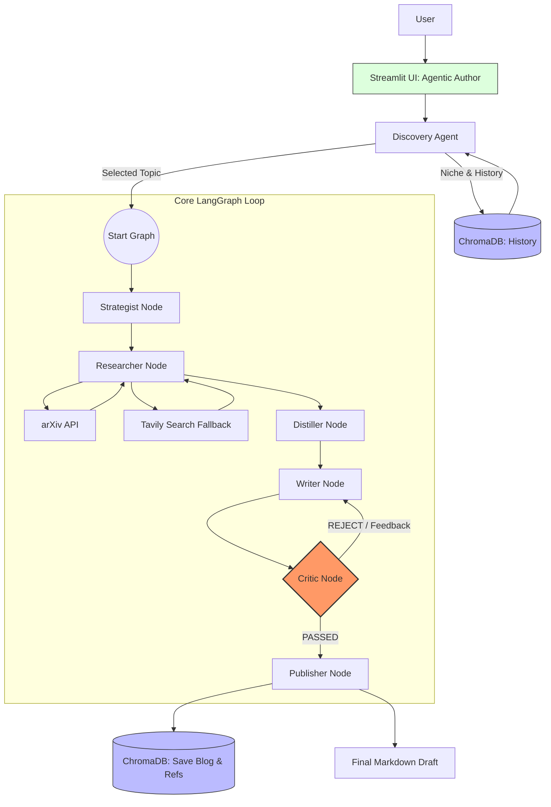

# Autonomous AI Research Engine: Documentation


This documentation provides a comprehensive overview of the **Agentic Author** project, a multi-agent system built with LangGraph, Pydantic, and Gemini 1.5 Flash.

---

## 1. Module Breakdown

### **Core Modules (`src/`)**

*   **`app.py`**: The entry point for the user interface. Built with Streamlit, it manages the session state, visualizes agent logs, and provides a "Knowledge Vault" to browse past publications. It orchestrates the execution of the LangGraph workflow.
*   **`state.py`**: Defines the `AgentState` using Pydantic. This file serves as the "single source of truth" for the data flowing between agents.
*   **`graph.py`**: The "brain" of the project. It defines the LangGraph `StateGraph`, implements all agent nodes (Discovery, Strategist, Researcher, Distiller, Writer, Critic, Publisher), and manages the conditional logic for revisions.
*   **`memory_manager.py`**: Handles persistent storage using ChromaDB. It manages two specialized collections for long-term project memory and citation tracking.
*   **`tools.py`**: Integrates external search capabilities, specifically the Arxiv API for academic papers and Tavily for general web search fallbacks.
*   **`llm_config.py`**: Centralized configuration for the Gemini 1.5 Flash model and Gemini Embedding 2. It includes robust error handling for API quota limits.

### **Utility Modules**
*   **`list_models.py`**: A helper script to verify available Gemini models.
*   **`test_nodes.py` / `verify_*.py`**: Scripts for unit testing individual graph nodes and verifying the end-to-end flow.

---

## 2. State Management

### **Pydantic Schema**
The system uses the `AgentState` class (inheriting from Pydantic's `BaseModel`) to ensure strict type hinting and validation. Every piece of data—from the research niche to the final draft—is structured and validated.

### **LangGraph Reducers (`operator.add`)**
To handle accumulating data across multiple nodes (e.g., several rounds of research), the project utilizes LangGraph **Reducers**.
*   **Implementation**: Fields like `research_notes` and `references` are wrapped in `Annotated[list, operator.add]`.
*   **Behavior**: Instead of the latest node's output overwriting the list, the new items are **appended** to the existing list.

---

## 3. Tool Logic & Token Optimization

### **Tool Integration**
*   **Arxiv API**: The primary source for research. It provides dense, academic data including abstracts and author details.
*   **Tavily Search**: Acts as a "Safety Net." If Arxiv returns sparse results for a specific query, the system automatically falls back to Tavily to ensure the Writer has sufficient context.

### **The Distiller Node (Token Efficiency)**
One of the most critical components for cost management (Free Tier) and context window health is the **Distiller node**.
*   **Responsibility**: The Researcher often gathers a massive amount of raw text from multiple papers.
*   **Logic**: Before passing this to the Writer, the Distiller node uses a specialized prompt to compress the raw notes into a high-density "Technical Fact Sheet." 
*   **Benefit**: This significantly reduces the token count for the Writer's prompt, preventing context overflow and ensuring focus on the most relevant facts.

---

## 4. Database: ChromaDB (Local Persistence)

The project uses an on-disk **ChromaDB** instance (`./chroma_db`) for vector search and long-term memory. This allows the system to remain 100% functional on a local machine without external database dependencies.

### **Collection Structure**
1.  **`blog_history`**: Stores the full text of past blogs. The metadata includes the `title` and a 4-5 line `summary`. This is used by the Strategist to ensure new content builds upon past work.
2.  **`reference_library`**: A specialized collection for academic citations. It stores paper titles, authors, and URLs linked to specific blog posts.

### **Embedding Model**
*   **Model**: `models/gemini-embedding-2`
*   **Purpose**: Converts text into high-dimensional vectors for semantic search.

---

## 5. Configuration & Setup

### **Environment Variables (`.env`)**
Create a `.env` file in the root directory with the following keys:

```bash
GOOGLE_API_KEY="your_google_gemini_api_key"
TAVILY_API_KEY="your_tavily_api_key"
```

### **Obtaining Free-Tier Keys**
1.  **Google Gemini**: Visit the [Google AI Studio](https://aistudio.google.com/) to generate a free API key.
2.  **Tavily Search**: Sign up at [Tavily AI](https://tavily.com/) for a free API key.

---

## 6. Project Architecture Diagram (Conceptual)

---

## 7. Technical Architecture (Mermaid.js)



---

## 8. Structured Architecture Description

### **Entry Points**
*   **User Interface (Streamlit):** Captures the user's Niche, Writing Style, and Topic preferences.
*   **Discovery Agent:** An initial node that acts as a pre-processor. It queries the Vector Database to find past topics and suggests new technical angles.

### **Processing Nodes**
*   **Strategist:** Analyzes the topic and generates a content plan and specific academic search queries.
*   **Researcher:** The data acquisition engine. It fetches dense papers from **arXiv** and falls back to **Tavily** when needed.
*   **Distiller:** The optimization layer. It compresses raw research data into a high-density "Technical Fact Sheet."
*   **Writer:** The creative engine. It transforms the Fact Sheet into a structured Markdown blog post.

### **Evaluation Loops**
*   **Critic/Editor Loop:** A quality control gate. The Critic evaluates the Writer's output against technical rubrics, triggering revisions if necessary.

### **Storage Layers (ChromaDB)**
*   **Knowledge Retrieval:** At the start of the flow, the system reads from the `blog_history` collection to prevent repetition.
*   **Academic Preservation:** Upon completion, the Publisher node saves the final blog content and academic references to ChromaDB for future use.
